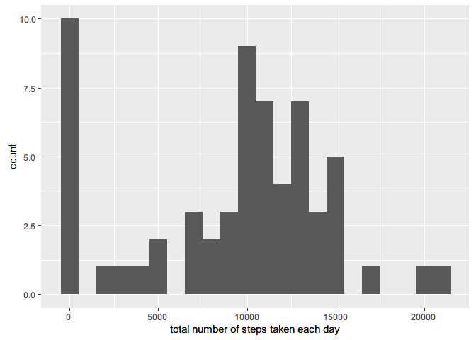
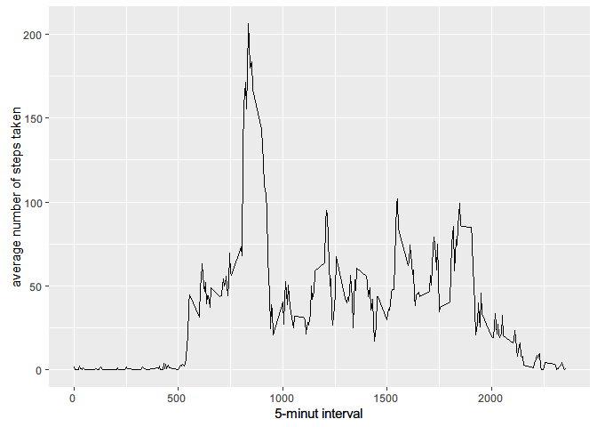
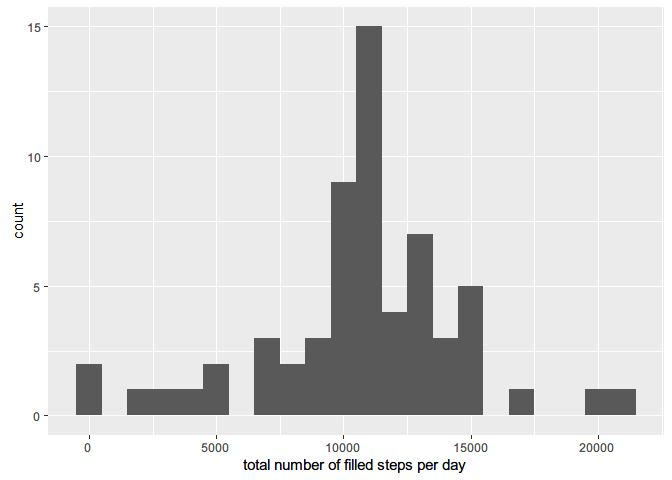
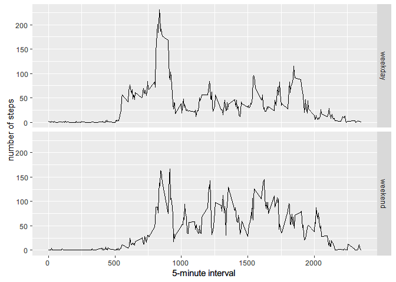

# Reproducible Research Project1
## Setting the environments

```r
#setwd("D:/My Documents/GitHub/GitHub/Reproducible Research/Course Project 1")
library(ggplot2)
```

```
## Warning: package 'ggplot2' was built under R version 3.3.1
```

```r
Sys.setlocale(category = "LC_ALL", locale = "english")
```

```
## [1] "LC_COLLATE=English_United States.1252;LC_CTYPE=English_United States.1252;LC_MONETARY=English_United States.1252;LC_NUMERIC=C;LC_TIME=English_United States.1252"
```

## Loading and preprocessing the data

```r
#fileurl <- "https://d396qusza40orc.cloudfront.net/repdata%2Fdata%2Factivity.zip"
#download.file(fileurl, "./activity.zip", mode = "wb")
#unzip("activity.zip")
activity <- read.csv("activity.csv")
activity$date <- as.Date(activity$date)
```

## What is mean total number of steps taken per day?
### Calculating total number of steps taken per day

```r
dailySteps <- tapply(activity$steps, activity$date, FUN = sum, na.rm = TRUE)
qplot(dailySteps, binwidth = 1000, xlab = "total number of steps taken each day")
```

<!-- -->

### Mean and Median of daily steps

```r
mean(dailySteps)
```

```
## [1] 9354.23
```

```r
median(dailySteps)
```

```
## [1] 10395
```

## Calculating the average daily activity pattern

```r
averSteps <- aggregate(x = list(steps = activity$steps), by = list(interval = activity$interval), FUN = mean, na.rm = TRUE)
p <- ggplot(averSteps, aes(x = interval, y = steps))
p + geom_line() + xlab("5-minut interval") + ylab("average number of steps taken")
```

<!-- -->

```r
maxInterval <- averSteps[which.max(averSteps$steps), ]
print(maxInterval)
```

```
##     interval    steps
## 104      835 206.1698
```

## Inputting missing values and generate new dataset

```r
missingValue <- is.na(activity$steps)
summary(missingValue)
```

```
##    Mode   FALSE    TRUE    NA's 
## logical   15264    2304       0
```

```r
filledValue <- function(steps, interval)
{
    #filled <- NA
    if(!is.na(steps))
      filled <-c(steps)
    else filled <- (averSteps[averSteps$interval == interval, "steps"])
    return(filled)
}

filledActivity <- activity
filledActivity$steps <- mapply(filledValue, filledActivity$steps, filledActivity$interval)
filledDailySteps <- tapply(filledActivity$steps, filledActivity$date, FUN = sum)
qplot(filledDailySteps, binwidth = 1000, xlab = "total number of filled steps per day")
```

<!-- -->

## Comparing the differences in activity pattern between weekday and weekend

```r
weekend <- weekdays(as.Date(filledActivity$date)) %in% c("Saturday", "Sunday")
filledActivity$daytype <- "weekday"
filledActivity$daytype[weekend ==TRUE] <- "weekend"
filledActivity$daytype <- as.factor(filledActivity$daytype)

weekdayCheck <- function(date)
{
    day  <- weekdays(date)
    if(day %in% c("Monday", "Tuesday", "Wednesday", "Thursday", "Friday"))
      return("weekday")
    else if (day %in% c("Saturday", "Sunday"))
      return("weekend")
      else stop("invalid date")
}

filledActivity$date <- as.Date(filledActivity$date)
filledActivity$day <- sapply(filledActivity$date, FUN = weekdayCheck)
```

## Final Plot with the difference between weekdays and weekends

```r
diff <- aggregate(steps ~ interval + day, data = filledActivity, mean)
p <- ggplot(diff, aes(interval, steps))
p + geom_line() + facet_grid(day ~ .) + xlab("5-minute interval") + ylab("number of steps")
```

<!-- -->

